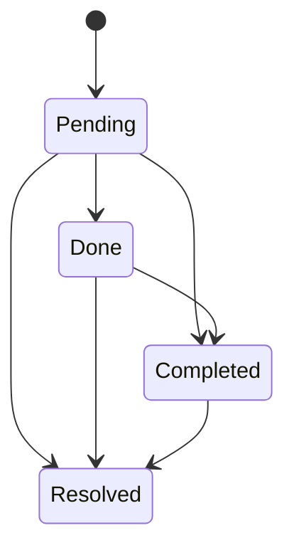
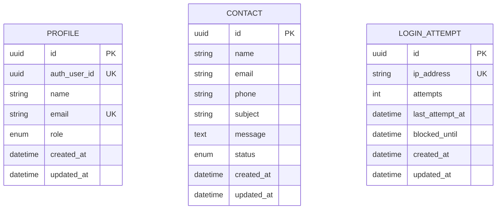
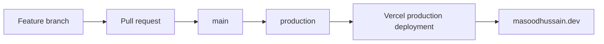

<div align="center">

# ⚙️ Syed Masood Hussain — Systems Engineering Portfolio

### A portfolio that does more than display projects.

It accepts real enquiries, stores them in PostgreSQL, sends email alerts, authenticates a seeded Admin, protects the login flow with reCAPTCHA v3 and IP-based rate limiting, and provides a private dashboard for managing every contact request.

[](https://masoodhussain.dev)
[](https://masoodhussain.dev)
[](https://github.com/masood2004/masood-portfolio)

<br />

[Explore the system](#-what-makes-this-portfolio-different) •
[View the architecture](#-architecture) •
[Run it locally](#-local-development) •
[Review security](#-security-model)

</div>

---

## 🧭 Choose your path

| I am a... | Start here |
|---|---|
| 👀 **Visitor** | [See what the public portfolio can do](#-public-experience) |
| 🧑‍💻 **Developer** | [Understand the stack and architecture](#-architecture) |
| 🛠️ **Maintainer** | [Set up the project locally](#-local-development) |
| 🔐 **Security reviewer** | [Inspect authentication and protection](#-security-model) |
| 🚀 **Deployer** | [Review the production workflow](#-deployment) |

---

## ✨ What makes this portfolio different?

Most portfolio websites end after showing an introduction, skills and project cards.

This one continues.

A visitor can send a real enquiry. The request is validated twice, saved in Supabase PostgreSQL through Prisma, and followed by an Admin notification through Resend. The owner can then sign in through a protected Supabase Auth flow, review the enquiry inside a private dashboard, and move it through a clear status lifecycle.

The result is a portfolio, contact-management system and lightweight Admin application in one production deployment.

### Current system status

| Capability | Status |
|---|:---:|
| Responsive public portfolio | ✅ |
| Project detail pages | ✅ |
| Client-side form validation | ✅ |
| Server-side form validation | ✅ |
| Supabase PostgreSQL persistence | ✅ |
| Prisma migrations and generated client | ✅ |
| Resend Admin email alerts | ✅ |
| Seeded single-Admin account | ✅ |
| Supabase email/password authentication | ✅ |
| Protected Admin dashboard | ✅ |
| Contact status management | ✅ |
| Google reCAPTCHA v3 | ✅ |
| IP-based login rate limiting | ✅ |
| Vercel production deployment | ✅ |
| Custom domain | ✅ |

---

## 🌐 Public experience

The public website is designed as a focused, monochrome systems-engineering portfolio.

### Visitors can

- Navigate smoothly between **About**, **Skills**, **Projects**, **Experience** and **Contact**.
- Explore detailed project pages generated from structured project data.
- View a responsive layout across mobile, tablet and desktop screens.
- Submit a real contact enquiry with name, email, phone, subject and message.
- Receive clear validation, loading, success and failure feedback.

### Quick links

- **Live homepage:** [masoodhussain.dev](https://masoodhussain.dev)
- **Projects section:** [masoodhussain.dev/#projects](https://masoodhussain.dev/#projects)
- **Contact section:** [masoodhussain.dev/#contact](https://masoodhussain.dev/#contact)
- **Admin login:** [masoodhussain.dev/login](https://masoodhussain.dev/login)

<details>
<summary><strong>📨 What happens when a visitor submits the Contact form?</strong></summary>

<br />

1. React Hook Form collects the input.
2. Zod validates it in the browser.
3. The browser sends a `POST` request to `/api/contacts`.
4. The server validates the request again using the shared Zod schema.
5. Prisma creates a new `Contact` record in Supabase PostgreSQL.
6. The record starts with the status `Pending`.
7. Resend attempts to send an email alert to the Admin.
8. The visitor receives a safe success or failure response.

The database is treated as the source of truth. If email delivery fails after the enquiry is stored, the visitor's message is not lost.

</details>

---

## 🧑‍💼 Admin experience

The private Admin area turns contact enquiries into manageable work rather than forgotten inbox messages.

### Dashboard capabilities

- View total, pending and resolved/completed enquiry counts.
- Review the most recent contacts.
- Open the full Contact Queries table.
- See sender name, email, phone, subject, message and submission time.
- Update a query to `Pending`, `Done`, `Completed` or `Resolved`.
- Sign out and invalidate the local session.

### Contact lifecycle



> The statuses are intentionally flexible. The Admin can use them according to the nature of each enquiry.

---

## 🏗 Architecture

```mermaid
flowchart LR
    Visitor[Portfolio visitor]
    UI[Next.js public UI]
    ContactAPI[POST /api/contacts]
    Validation[Shared Zod validation]
    Prisma[Prisma ORM]
    Database[(Supabase PostgreSQL)]
    Resend[Resend email alert]
    Inbox[Admin inbox]

    Admin[Admin user]
    LoginUI[Admin login]
    Recaptcha[Google reCAPTCHA v3]
    RateLimit[IP rate limiter]
    SupabaseAuth[Supabase Auth]
    Dashboard[Protected dashboard]
    StatusAPI[PATCH contact status]

    Visitor --> UI --> ContactAPI --> Validation --> Prisma --> Database
    Database --> Resend --> Inbox

    Admin --> LoginUI --> Recaptcha --> RateLimit --> SupabaseAuth --> Dashboard
    Dashboard --> StatusAPI --> Prisma
```



### Request boundaries

| Layer | Responsibility |
|---|---|
| **Browser** | User interaction, responsive UI and immediate form feedback |
| **Next.js Route Handlers** | Trusted server boundary, validation, authentication and safe responses |
| **Prisma** | Type-safe database access and migrations |
| **Supabase PostgreSQL** | Persistent application data |
| **Supabase Auth** | Admin identity and session management |
| **Resend** | Transactional email notification |
| **Google reCAPTCHA** | Bot-risk scoring for Admin login |
| **Vercel** | Production hosting, server execution and environment configuration |

---

## 🗃 Data model



### Application records

| Model | Purpose |
|---|---|
| `Profile` | Connects the single authorised Admin profile to a Supabase Auth user |
| `Contact` | Stores portfolio enquiries and their current workflow status |
| `LoginAttempt` | Tracks failed login attempts and temporary IP blocks |

---

## 🧰 Technology stack

<div align="center">


</div>

| Area | Technology |
|---|---|
| Framework | Next.js App Router |
| UI | React, TypeScript and Tailwind CSS |
| Forms | React Hook Form |
| Validation | Zod |
| Database | Supabase PostgreSQL |
| ORM | Prisma with PostgreSQL adapter |
| Authentication | Supabase Auth with SSR cookies |
| Email | Resend |
| Bot protection | Google reCAPTCHA v3 |
| Hosting | Vercel |
| Domain | `masoodhussain.dev` |

---

## 🔐 Security model

Security is applied at several independent layers rather than trusted to a single check.

| Protection | Implementation |
|---|---|
| Input validation | Shared Zod schemas on client and server |
| Database secrecy | Database URLs remain server-only environment variables |
| Admin identity | Supabase email/password authentication |
| Admin authorisation | Server verifies the authenticated user against the Admin profile |
| Protected pages | Admin layout requires an authorised profile |
| Protected mutations | Contact status API checks Admin authentication independently |
| Bot protection | reCAPTCHA v3 token, action, hostname and score verification |
| Brute-force protection | Failed logins tracked per IP address |
| Temporary blocking | Sixth failed attempt triggers a 15-minute block |
| Session handling | Cookie-based Supabase SSR session flow |
| Secret handling | Service keys, email keys and passwords are never exposed to browser code |
| Email safety | Visitor content is escaped before insertion into HTML email |

<details>
<summary><strong>🛡️ Login security sequence</strong></summary>

<br />

```text
Admin submits credentials
        │
        ▼
Server determines client IP
        │
        ▼
Existing IP block checked
        │
        ▼
reCAPTCHA token verified
(success + action + hostname + score)
        │
        ▼
Supabase credentials verified
        │
        ▼
Profile role checked in PostgreSQL
        │
        ├── Failure → increment IP attempts
        │              └── attempt 6 → block for 15 minutes
        │
        └── Success → clear previous failures → open dashboard
```

</details>

> **Important:** Never commit `.env`, database connection strings, Admin credentials, service-role keys, Resend keys or the reCAPTCHA secret.

---

## 📁 Project structure

```text
masood-portfolio/
├── prisma/
│   ├── migrations/              # Versioned database changes
│   └── schema.prisma            # Profile, Contact and LoginAttempt models
├── scripts/
│   └── seed-admin.ts            # Creates/updates the single Admin safely
├── src/
│   ├── app/
│   │   ├── admin/                # Protected dashboard and contact management
│   │   ├── api/
│   │   │   ├── admin/            # Protected Admin mutations
│   │   │   ├── auth/             # Login and logout endpoints
│   │   │   └── contacts/         # Public contact submission endpoint
│   │   ├── login/                # Admin login page
│   │   ├── projects/[id]/        # Dynamic project detail pages
│   │   ├── layout.tsx
│   │   └── page.tsx
│   ├── components/
│   │   ├── admin/                # Login, sidebar and status controls
│   │   └── ...                   # Public portfolio sections
│   ├── data/                     # Structured portfolio project data
│   ├── generated/prisma/         # Generated Prisma client; not committed
│   ├── lib/
│   │   ├── auth/                 # Admin authorisation helpers
│   │   ├── email/                # Resend contact alert service
│   │   ├── security/             # reCAPTCHA and IP rate limiting
│   │   ├── supabase/             # Browser/server session utilities
│   │   ├── validations/          # Shared Zod schemas
│   │   └── prisma.ts
│   └── proxy.ts                  # Supabase session refresh boundary
├── package.json
├── prisma.config.ts
└── README.md
```

---

## 🚀 Local development

### Prerequisites

Before starting, have the following ready:

- Node.js 20 or newer
- npm
- A Supabase project
- PostgreSQL connection strings from Supabase
- A Resend account and verified sending domain
- Google reCAPTCHA v3 keys

### 1. Clone the repository

```bash
git clone https://github.com/masood2004/masood-portfolio.git
cd masood-portfolio
```

### 2. Install dependencies

```bash
npm install
```

The `postinstall` script generates the Prisma client automatically.

### 3. Configure environment variables

Create a local `.env` file in the project root.

```env
# Public site
NEXT_PUBLIC_SITE_URL="http://localhost:3000"

# Database
DATABASE_URL=""
DIRECT_URL=""

# Supabase Auth
NEXT_PUBLIC_SUPABASE_URL=""
NEXT_PUBLIC_SUPABASE_PUBLISHABLE_KEY=""

# Required only when running the Admin seed script
SUPABASE_SERVICE_ROLE_KEY=""
ADMIN_NAME=""
ADMIN_EMAIL=""
ADMIN_PASSWORD=""

# Resend
RESEND_API_KEY=""
RESEND_FROM_EMAIL=""
CONTACT_ALERT_TO_EMAIL=""

# Google reCAPTCHA v3
NEXT_PUBLIC_RECAPTCHA_SITE_KEY=""
RECAPTCHA_SECRET_KEY=""
RECAPTCHA_ALLOWED_HOSTNAMES="localhost"
RECAPTCHA_SCORE_THRESHOLD="0.5"
```

<details>
<summary><strong>🔎 Environment-variable guide</strong></summary>

<br />

| Variable | Browser-visible? | Purpose |
|---|:---:|---|
| `NEXT_PUBLIC_SITE_URL` | Yes | Canonical website URL |
| `DATABASE_URL` | No | Runtime PostgreSQL connection |
| `DIRECT_URL` | No | Direct/session connection for Prisma migrations |
| `NEXT_PUBLIC_SUPABASE_URL` | Yes | Supabase project URL |
| `NEXT_PUBLIC_SUPABASE_PUBLISHABLE_KEY` | Yes | Public Supabase client key |
| `SUPABASE_SERVICE_ROLE_KEY` | **No** | Server-only Admin seeding operations |
| `ADMIN_NAME` | No | Seeded profile name |
| `ADMIN_EMAIL` | No | Seeded Admin email |
| `ADMIN_PASSWORD` | **No** | Seeded Admin password |
| `RESEND_API_KEY` | **No** | Server-side email API authentication |
| `RESEND_FROM_EMAIL` | No | Verified sender identity |
| `CONTACT_ALERT_TO_EMAIL` | No | Destination for enquiry alerts |
| `NEXT_PUBLIC_RECAPTCHA_SITE_KEY` | Yes | Browser-side reCAPTCHA execution |
| `RECAPTCHA_SECRET_KEY` | **No** | Server-side reCAPTCHA verification |
| `RECAPTCHA_ALLOWED_HOSTNAMES` | No | Approved verification hosts |
| `RECAPTCHA_SCORE_THRESHOLD` | No | Minimum accepted risk score |

</details>

### 4. Prepare the database

```bash
npx prisma validate
npx prisma generate
npx prisma migrate dev
```

### 5. Seed the single Admin

```bash
npm run seed:admin
```

The seed script is designed to be repeatable. It creates or updates the authorised Admin while preventing accidental creation of conflicting Admin users and profiles.

### 6. Start the development server

```bash
npm run dev
```

Open:

```text
http://localhost:3000
```

Admin login:

```text
http://localhost:3000/login
```

---

## ⌨️ Available scripts

| Command | Purpose |
|---|---|
| `npm run dev` | Start the Next.js development server |
| `npm run build` | Create a production build |
| `npm run start` | Start the built production application |
| `npm run lint` | Run ESLint |
| `npm run postinstall` | Generate the Prisma client after installation |
| `npm run seed:admin` | Create or update the single Admin account and profile |

### Recommended verification sequence

```bash
npx prisma validate
npx prisma generate
npm run lint
npm run build
```

---

## 🧪 Manual test missions

Turn testing into a quick system tour.

<details>
<summary><strong>Mission 1 — Submit a real enquiry</strong></summary>

1. Open the homepage.
2. Navigate to Contact.
3. Submit valid details.
4. Confirm the success message.
5. Confirm a new `contacts` record exists in Supabase.
6. Confirm the record starts as `Pending`.
7. Confirm a Resend email was created.

</details>

<details>
<summary><strong>Mission 2 — Manage the enquiry</strong></summary>

1. Open `/login`.
2. Sign in with the seeded Admin.
3. Open Contact Queries.
4. Find the test record.
5. Change its status.
6. Confirm the change persists after refreshing.

</details>

<details>
<summary><strong>Mission 3 — Test route protection</strong></summary>

1. Log out.
2. Manually open `/admin`.
3. Confirm the application redirects to `/login`.
4. Attempt a protected status request without authentication.
5. Confirm the API rejects it.

</details>

<details>
<summary><strong>Mission 4 — Test brute-force protection</strong></summary>

1. Enter an incorrect password five times.
2. Confirm each attempt receives a generic credential error.
3. Submit a sixth failed attempt.
4. Confirm the response is HTTP `429` with a friendly block message.
5. Confirm `blocked_until` is stored in `login_attempts`.
6. Remove the development test record before continuing.

</details>

---

## 🚢 Deployment

The application is deployed on Vercel and served through the custom domain:

### [https://masoodhussain.dev](https://masoodhussain.dev)

### Production flow



### Deployment checklist

- Push tested changes through a feature branch.
- Merge the pull request into `main`.
- Merge stable `main` into `production`.
- Confirm all Production environment variables exist in Vercel.
- Confirm the Vercel deployment reaches `Ready`.
- Test the public form, email alert, Admin login, dashboard, status update and logout on the live domain.

---

## 🧯 Troubleshooting

<details>
<summary><strong>Prisma client cannot be found</strong></summary>

Run:

```bash
npx prisma generate
```

Then restart the development server.

</details>

<details>
<summary><strong>Database connection fails</strong></summary>

Check that:

- `DATABASE_URL` is the runtime pooler connection.
- `DIRECT_URL` is available for migrations.
- The password is URL-encoded when it contains special characters.
- The Supabase project is active.

</details>

<details>
<summary><strong>Contact is stored but no email arrives</strong></summary>

Check:

- `RESEND_API_KEY`
- `RESEND_FROM_EMAIL`
- `CONTACT_ALERT_TO_EMAIL`
- Resend domain verification
- Resend delivery logs and the recipient's Spam folder

The contact record can still be saved even when the notification provider fails.

</details>

<details>
<summary><strong>reCAPTCHA stays on “Loading verification...”</strong></summary>

Check:

- `NEXT_PUBLIC_RECAPTCHA_SITE_KEY`
- Whether the current hostname is registered with Google
- Content blockers or browser privacy extensions
- Browser console and Network logs

</details>

<details>
<summary><strong>Admin login works locally but not in production</strong></summary>

Check that Vercel Production has:

- Supabase URL and publishable key
- Database connection variables
- reCAPTCHA site and secret keys
- Correct production hostname allow-list

After changing Vercel environment variables, trigger a new deployment.

</details>

---

## 🛣 Roadmap

The core internship scope is complete. Natural future extensions include:

- Automated unit and integration tests
- Contact search, filtering and pagination
- Status-change audit history
- Admin activity logs
- Accessible confirmation dialogs
- Analytics and performance monitoring
- Optional reply-from-dashboard workflow
- Database-backed email retry queue

---

## 🎓 Project context

This project was extended as a full-stack practical assignment for the **Dafi Labs × EmpRadar.ai MERN Stack Internship**.

The implementation demonstrates more than visual design. It covers planning, responsive UI engineering, persistence, server-side validation, transactional email, seeded authentication, protected administration, abuse prevention, Git workflow and production deployment.

---

## 👤 Author

**Syed Masood Hussain**  
Systems Engineer and Software Developer

- Portfolio: [masoodhussain.dev](https://masoodhussain.dev)
- GitHub: [github.com/masood2004](https://github.com/masood2004)
- LinkedIn: [linkedin.com/in/masood-h](https://www.linkedin.com/in/masood-h/)
- Email: [hmasood3288@gmail.com](mailto:hmasood3288@gmail.com)

---

<div align="center">

### Built as a portfolio. Engineered as a system.

<sub>Next.js · TypeScript · Supabase · Prisma · Resend · reCAPTCHA · Vercel</sub>

<br /><br />

[⬆ Back to top](#️-syed-masood-hussain--systems-engineering-portfolio)

</div>
